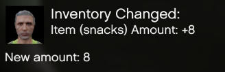
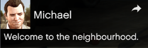
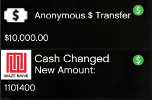
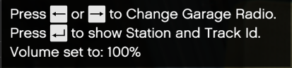
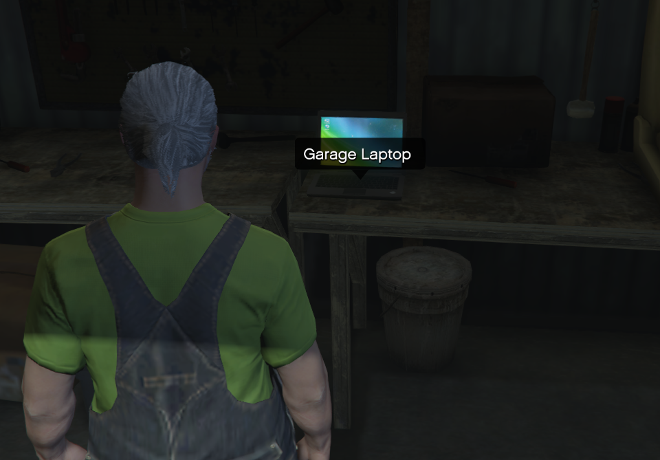
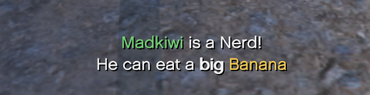
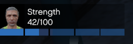
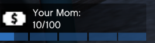
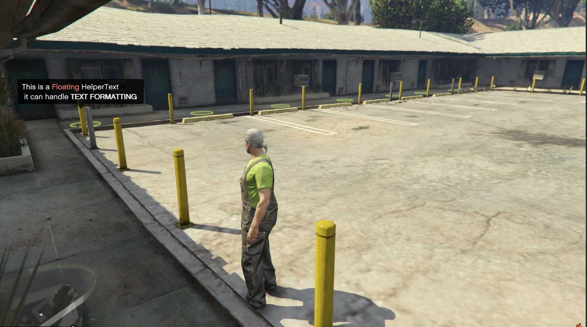

# mkHelper
Madkiwi's FiveM Helper Library  
  
Current Exports:  
PlayerNotification - Displays a notification using the player's headshot.  
CharacterNotification - Displays a notification based on the character headshot requested.  
DictionaryNotification - Displays a notification based on dictionary texture images.  
BasicHelperText - Displays Basic Help Text in the top left.  
FloatingHelperText - Displays a FLoating Help Text at a 3D vector  
MissionHelperText - Displays a subtitle style mission Text  
PlayerStatsNotification - Displays a Player Stat Notification Based on the Player  
CustomStatsNotification - Displays a Stat Notification Based on Texture Dictionary  
  
  
Usage:  
  
PlayerNotification  
```exports["mkHelper"]:PlayerNotification("TITLE_STRING", 'SUBTITLE_STRING', 'CONTENT_MESSAGE_TEXT', ICONTYPE, PLAYSOUND_BOOLEAN)```  
  
  
CharacterNotification  
```exports["mkHelper"]:CharacterNotification("CHAR_NAME_STRING", "TITLE_STRING", 'SUBTITLE_STRING', 'CONTENT_MESSAGE_TEXT', ICONTYPE, PLAYSOUND_BOOLEAN)```   
  
  
DictionaryNotification  
```exports["mkHelper"]:DictionaryNotification("TEXTURE_DICT", "TXD_ITEM_NAME", "TITLE_STRING", 'SUBTITLE_STRING', 'CONTENT_MESSAGE_TEXT', ICONTYPE, PLAYSOUND_BOOLEAN)```  
  
  
BasicHelperText  
```exports["mkHelper"]:BasicHelperText("UNIQUE_TEXT_STRING_ID", 'TITLE_STRING', 'CONTENT_MESSAGE_TEXT', DURATION_INT, PLAYSOUND_BOOLEAN)```  
  
  
FloatingHelperText  
```exports["mkHelper"]:FloatingHelperText('UNIQUE_TEXT_STRING_ID', "TITLE_STRING", POSITION_VECTOR3, DURATION_INT, PLAYSOUND_BOOLEAN)```  
  
  
MissionHelperText  
```exports["mkHelper"]:MissionHelperText('UNIQUE_TEXT_STRING_ID', "TITLE_STRING", DURATION_INT, PLAYSOUND_BOOLEAN)```  
  
  
PlayerStatsNotification  
```exports["mkHelper"]:PlayerStatsNotification('STATNAME', CURRENT_VALUE, CHANGE_AMOUNT, DURATION_INT, PLAYSOUND_BOOLEAN)```  
  
  
CustomStatsNotification  
```exports["mkHelper"]:CustomStatsNotification('UNIQUE_TEXT_STRING_ID', "TITLE_STRING", "TEXTURE_DICT", "TXD_ITEM_NAME", CURRENT_VALUE, CHANGE_AMOUNT, DURATION_INT, PLAYSOUND_BOOLEAN)```  
  
  
Change Amount will cause White flashing on Positive Value and Red on Negative Value:  
Setting it to 0 will make NO visual Change to value.  
[video of redstats in usage.](examples/statsred.mp4)  
  
Assistance Documentation:  
  
-- Icon types:  
No Icon: 0, 4, 5, 6  
Speech Bubble: 1  
Message: 2  
Friend Request: 3  
Arrow: 7  
RP: 8  
Money: 9  
  
-- Character Textures:  
https://wiki.rage.mp/wiki/Notification_Pictures  
  
-- Dictionary Textures:  
https://wiki.rage.mp/wiki/Textures
  
-- Text Formatting for MissionHelper:  
https://docs.fivem.net/docs/game-references/text-formatting/  
  
-- PLAYER STAT NAMES  
"PS_SPEC_AB"  
"PS_STAMINA"  
"PS_LUNG"  
"PS_STRENGTH"  
"PS_DRIVING"  
"PS_FLYING"  
"PS_SHOOTING"  
"PS_STEALTH"  


  
EXAMPLE OF USAGE: (Produces examples at route69 motels)  
  
``` 
WaitTimeratm = 1000
------------------------
local debguSpot = vector4(1139.9027099609,2643.6975097656,37.732906341553,7.4418272972107)
local missionspot = vector4(1135.2130126953,2643.4765625,37.730884552002,178.13157653809)
local charcterspot = vector4(1130.8306884766,2643.4975585938,37.729900360107,90.499114990234)
local playerspot = vector4(1126.0106201172,2643.4897460938,37.733320236206,90.880821228027)
local dictspot = vector4(1121.3190917969,2643.4592285156,37.733058929443,89.377571105957)
local statspot = vector4(1117.9373779297,2643.455078125,37.733695983887,82.238441467285)
local custstatspot = vector4(1113.4642333984,2643.5876464844,37.733753204346,78.950294494629)
local debugZone = 260
------------------------
Citizen.CreateThread(function()
    while NetworkIsSessionStarted() do
        WaitTimeratm = 1000
        ------------------------
        mPed = GetPlayerPed(-1)
        mPedCoords = GetEntityCoords(mPed)
        mPedInteriorId = GetInteriorFromEntity(mPed)
        mPedroomId = GetRoomKeyFromEntity(mPed)
        mPedZone = GetZoneAtCoords(mPedCoords[1], mPedCoords[2], mPedCoords[3])
        ------------------------
        if mPedInteriorId == 0 then
            if mPedZone == debugZone then
                if IsEntityAtCoord(mPed, missionspot[1], missionspot[2], missionspot[3], 59.0,59.0,59.0, 0,1,0) then
                    WaitTimeratm = 1
                    -- Mission
                    DrawMarker(1, missionspot[1], missionspot[2], missionspot[3] - 0.59, 
                    0.0, 0.0, 0.0, 0.0, 0.0, 0.0, 1.0, 1.0,
                    0.1, 186, 218, 85, 0.8, false, false, 2,
                    false, nil, nil, false)
                    if IsEntityAtCoord(mPed, missionspot[1], missionspot[2], missionspot[3], 1.0,1.0,1.0, 0,1,0) then
                        exports["mkHelper"]:BasicHelperText('madkiwi_debug', 'Press ~INPUT_FRONTEND_ACCEPT~ to MissionHelperText', 100, false)
                        if IsControlJustPressed(0, 201) then
                            ------------------------
                            exports["mkHelper"]:MissionHelperText('madkiwi_debug2', '~g~Madkiwi~s~ is a Nerd!~n~He can eat a ~h~big~h~ ~y~Banana~s~~n~ ~boop~', 5000, false)
                            ------------------------          
                        end
                    end
                    -- Character Notification
                    DrawMarker(1, charcterspot[1], charcterspot[2], charcterspot[3] - 0.59, 
                    0.0, 0.0, 0.0, 0.0, 0.0, 0.0, 1.0, 1.0,
                    0.1, 186, 218, 85, 0.8, false, false, 2,
                    false, nil, nil, false)
                    if IsEntityAtCoord(mPed, charcterspot[1], charcterspot[2], charcterspot[3], 1.0,1.0,1.0, 0,1,0) then
                        exports["mkHelper"]:BasicHelperText('madkiwi_debug', 'Press ~INPUT_FRONTEND_ACCEPT~ to CharacterNotification', 100, false)
                        if IsControlJustPressed(0, 201) then
                            ------------------------
                            exports["mkHelper"]:CharacterNotification("CHAR_FRANKLIN", "Character", 'Subtitle', "notification", 2, true)
                            ------------------------                        
                        end
                    end
                    -- Dictionary Notification
                    DrawMarker(1, dictspot[1], dictspot[2], dictspot[3] - 0.59, 
                    0.0, 0.0, 0.0, 0.0, 0.0, 0.0, 1.0, 1.0,
                    0.1, 186, 218, 85, 0.8, false, false, 2,
                    false, nil, nil, false)
                    if IsEntityAtCoord(mPed, dictspot[1], dictspot[2], dictspot[3], 1.0,1.0,1.0, 0,1,0) then
                        exports["mkHelper"]:BasicHelperText('madkiwi_debug', 'Press ~INPUT_FRONTEND_ACCEPT~ to DictionaryNotification', 100, false)
                        if IsControlJustPressed(0, 201) then
                            ------------------------
                            exports["mkHelper"]:DictionaryNotification("commonmenu", "mp_specitem_cash", "Dictionary", 'Subtitle', "notification", 9, true)
                            ------------------------                        
                        end
                    end
                    -- Player Notification
                    DrawMarker(1, playerspot[1], playerspot[2], playerspot[3] - 0.59, 
                    0.0, 0.0, 0.0, 0.0, 0.0, 0.0, 1.0, 1.0,
                    0.1, 186, 218, 85, 0.8, false, false, 2,
                    false, nil, nil, false)
                    if IsEntityAtCoord(mPed, playerspot[1], playerspot[2], playerspot[3], 1.0,1.0,1.0, 0,1,0) then
                        exports["mkHelper"]:BasicHelperText('madkiwi_debug', 'Press ~INPUT_FRONTEND_ACCEPT~ to PlayerNotification', 100, false)
                        if IsControlJustPressed(0, 201) then
                            ------------------------
                            exports["mkHelper"]:PlayerNotification("Player", 'Subtitle', "notification", 2, true)
                            ------------------------                        
                        end
                    end
                    -- floating and basic notications
                    DrawMarker(1, debguSpot[1],debguSpot[2],debguSpot[3] - 0.59, 
                    0.0, 0.0, 0.0, 0.0, 0.0, 0.0, 1.0, 1.0,
                    0.1, 186, 218, 85, 0.8, false, false, 2,
                    false, nil, nil, false)
                    if IsEntityAtCoord(mPed, debguSpot[1],debguSpot[2],debguSpot[3], 1.0,1.0,1.0, 0,1,0) then                                    
                        exports["mkHelper"]:BasicHelperText('madkiwi_debug', 'This is a BasicHelperText, you can use ~g~colors~s~ and ~h~TEXT FORMATTING~h~ too! Even button gfx like ~INPUT_FRONTEND_CANCEL~ ~n~they all display using controller too!', 100, false)
                    else
                        if IsEntityAtCoord(mPed, debguSpot[1],debguSpot[2],debguSpot[3], 25.0,25.0,1.0, 0,1,0) then
                            exports["mkHelper"]:FloatingHelperText('madkiwi_debug', 'This is a ~o~Floating~s~ HelperText~n~ it can handle ~h~TEXT FORMATTING~h~', debguSpot, 10, false)
                        end
                    end
                    -- Stat Notifications
                    DrawMarker(1, statspot[1],statspot[2],statspot[3] - 0.59, 
                    0.0, 0.0, 0.0, 0.0, 0.0, 0.0, 1.0, 1.0,
                    0.1, 186, 218, 85, 0.8, false, false, 2,
                    false, nil, nil, false)
                    if IsEntityAtCoord(mPed, statspot[1],statspot[2],statspot[3], 1.0,1.0,1.0, 0,1,0) then 
                        exports["mkHelper"]:BasicHelperText('madkiwi_debug', 'Press ~INPUT_FRONTEND_ACCEPT~ to PlayerStatsNotification', 100, false)
                        if IsControlJustPressed(0, 201) then
                            ------------------------                                   
                            exports["mkHelper"]:PlayerStatsNotification('PS_STAMINA', 45, 5, 1000, false)
                        end
                    end
                    -- Stat Notifications
                    DrawMarker(1, custstatspot[1],custstatspot[2],custstatspot[3] - 0.59, 
                    0.0, 0.0, 0.0, 0.0, 0.0, 0.0, 1.0, 1.0,
                    0.1, 186, 218, 85, 0.8, false, false, 2,
                    false, nil, nil, false)
                    if IsEntityAtCoord(mPed, custstatspot[1],custstatspot[2],custstatspot[3], 1.0,1.0,1.0, 0,1,0) then 
                        exports["mkHelper"]:BasicHelperText('madkiwi_debug', 'Press ~INPUT_FRONTEND_ACCEPT~ to CustomStatsNotification', 100, false)
                        if IsControlJustPressed(0, 201) then
                            ------------------------                                   
                            exports["mkHelper"]:CustomStatsNotification('Weed_Storage', 'Weed Storage Level', 'commonmenu', 'mp_specitem_weed', 45, 5, 1000, false)
                        end
                    end
                end
            end
        end
        ------------------------
        Citizen.Wait(WaitTimeratm)
    end
end)
```  